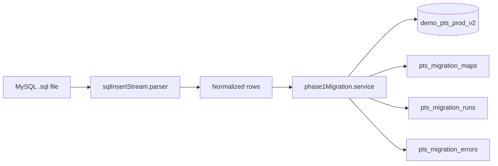

# SQL → MongoDB V2 — Phase 1 Migration

Import a legacy **MySQL `.sql` export** directly into **MongoDB V2** for demo environments. No MySQL server, no legacy Mongo source, no V1 APIs.

**Target database:** `demo_pts_prod_v2` (from `config.yaml` → `mongodb.v2Db` / `MONGO_V2_DB`).

## Strict rules

| Rule | Detail |
|------|--------|
| Fresh ObjectIds | Never reuse MySQL numeric ids in business collections |
| No legacy fields | No `sourceId`, `mysqlId`, or numeric refs on `pts_*` documents |
| Legacy ids only in | `pts_migration_runs`, `pts_migration_maps`, `pts_migration_errors` |

## Phase 1 scope

| Imported | MySQL table |
|----------|-------------|
| Admins | `admins` |
| Users | `users` |
| Clients | `clients` |
| Projects | `projects` |
| Project assignments | `project_users` |
| Work categories | `project_default_tasks` |

**Ignored (Phase 2+):** `working_hours`, `daily_notes`, tasks, attachments, activity, timers, reports, converse.

### Phase 2 extension point

`working_hours` → Activity V2 (timesheet weeks, time entries, approvals). Hook: extend `src/v2/migration/sql/services/phase1Migration.service.js` after Phase 1 completes, or add `phase2ActivityMigration.service.js`.

## Architecture



**Reused V2 modules:** `pts_accounts`, `pts_users`, `pts_clients`, `pts_projects`, `pts_project_assignments`, `pts_work_categories`, RBAC roles, repositories under `src/v2/modules/`.

## Commands

```bash
# Dry run (no writes)
npm run migrate:phase1 -- --file=/path/to/u185411446_prodpts.sql --dryRun=true --verbose=true

# Live import (requires seeded roles: npm run v2:seed)
npm run migrate:phase1 -- --file=/path/to/u185411446_prodpts.sql --dryRun=false --verbose=true

# Equivalent root CLI
node migrate-phase1.js --file=./u185411446_prodpts.sql --dryRun=true --reset=false --verbose=true

# Rollback a live run (deletes only documents tracked in maps for that runId)
npm run migrate:phase1:rollback -- --runId=<ObjectId>
```

## Import order

1. Users (accounts + `pts_users` + roles)
2. Admins (skip email matching seeded super admin)
3. Clients
4. Projects (resolve client via migration map; optional initial budget from `hours`)
5. Project assignments (skip orphan / deleted rows)
6. Work categories (from `project_default_tasks`)

## Rollback

`--reset=true` requires `--runId=<previous-run-id>`. Deletes documents whose `newObjectId` appears in `pts_migration_maps` for that run. **Does not drop collections.**

## QA checklist

- [ ] `npm run v2:seed` completed (roles + super admin)
- [ ] `MONGO_V2_DB=demo_pts_prod_v2` (or config.yaml `v2Db`)
- [ ] Dry run: expected counts match SQL dump
- [ ] Live run: report shows imported/skipped/errors
- [ ] Login with migrated user (bcrypt passwords preserved)
- [ ] Seeded super admin not duplicated
- [ ] No `legacyId` / `sourceId` on business collections
- [ ] Projects reference valid `clientId` ObjectIds
- [ ] Assignments reference valid `projectId` + `userId`
- [ ] `pts_work_categories` contains imported default task names
- [ ] Rollback removes only run-scoped documents

## Default SQL path

If `--file` is omitted, the CLI looks for:

`../legacy/u185411446_prodpts.sql` relative to the API repo (sibling `pts/legacy/` folder).
