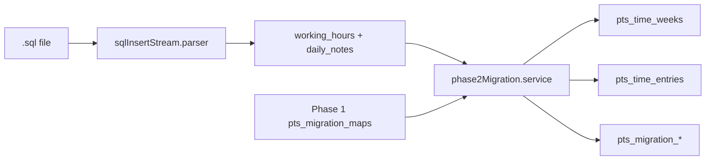

# SQL → MongoDB V2 — Phase 2 Migration (Activity / Time Tracking)

Import legacy **`working_hours`** and **`daily_notes`** from a MySQL `.sql` export into existing V2 activity collections on **`demo_pts_prod_v2`**.

**Prerequisite:** Phase 1 completed (`pts_migration_maps` must contain user, project, and work category mappings).

## Scope

| Imported | MySQL table | V2 target |
|----------|-------------|-----------|
| Working hours (per-day expansion) | `working_hours` | `pts_time_entries` + `pts_time_weeks` |
| Daily notes (when linked) | `daily_notes` | merged into entry `description` |

**Not imported:** tasks, reports, notifications, converse, uploads, project requests.

## Strict rules

- Fresh Mongo `ObjectId`s only on business collections
- Legacy MySQL ids only in `pts_migration_runs`, `pts_migration_maps`, `pts_migration_errors`
- No active timers, sockets, or notifications
- Entries imported as **`approved`** / weeks as **`approved`**
- `source` = `manual` (V2 schema enum; migration provenance tracked in maps)

## Architecture



## Commands

```bash
# Dry run
npm run migrate:phase2 -- \
  --file=/path/to/u185411446_prodpts.sql \
  --dryRun=true \
  --verbose=true \
  --mode=insert-only

# Live import
npm run migrate:phase2 -- \
  --file=/path/to/u185411446_prodpts.sql \
  --dryRun=false \
  --mode=insert-only

# Upsert (update existing mapped entries)
npm run migrate:phase2 -- --file=./dump.sql --dryRun=false --mode=upsert

# Rollback Phase 2 only (by runId)
npm run migrate:phase2:rollback -- --runId=<phase2-run-object-id>
```

## Idempotency

- Default `--mode=insert-only`: skips entries already in `pts_migration_maps` (`entityType=time_entry`, `oldCollection=working_hours`)
- Map key per day: `oldId = working_hours.id * 10 + dayIndex`
- Checksum stored in map metadata (`sourceHash`)

## Validation checklist

- [ ] Phase 1 maps present for users/projects/work categories
- [ ] Dry run: expanded entry count looks reasonable
- [ ] No numeric `userId` / `projectId` on `pts_time_entries`
- [ ] No orphan entries (missing week/project/user)
- [ ] Week `totalMinutes` matches sum of entries
- [ ] No active timers created
- [ ] Rollback removes only Phase 2 run maps + entries/weeks

## Example report (dry run)

```
Working hours rows
  Expected:  28500
  Expanded:  142000
  Imported:  98000
  Skipped:   44000
  Duplicate: 0

Weeks
  Created:   4200
  Updated:   0

Totals
  Minutes:   5840000
  Hours:     97333.33
  Users:     18
  Projects:  210
```

See also: [SQL_PHASE1.md](./SQL_PHASE1.md)
