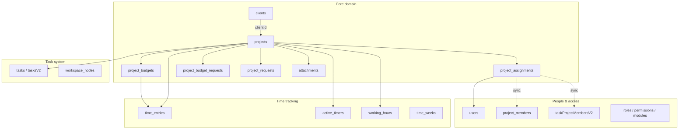

# PTS Projects Module — Current State Documentation

**Note:** There is no standalone **Product** entity or `products` collection in PTS today. Billable client work is modeled as **Projects** (`module key: projects`). This document describes that module end-to-end — backend, frontend, flows, and every MongoDB collection it touches.

---

## 1. Executive Summary

The Projects module is the central hub of the Project Tracking System (PTS). A project represents a unit of client work: fixed hours, fixed budget, retainer, hybrid, or internal. Every project belongs to exactly one **client**, can have **team members** assigned, **hour budgets** tracked, **change requests** approved, **time logged** against it, **tasks** organized on boards, and **files** attached.

**Architecture at a glance:**

| Layer | Location |
|-------|----------|
| Backend module | `project-tracking-system-api/src/app/Modules/projects/` |
| MongoDB schemas | `src/app/MongoModels/core.model.js` (+ task/member models) |
| API base | `/api/project/*`, `/api/projectUsers/*`, `/api/projectRequest/*`, `/api/projects/*` |
| Frontend (Angular) | `pts-application/src/app/modules/admin-module/mange-projects/` |
| HTTP services | `pts-application/src/app/modules/shared/services/project-*.service.ts` |
| Access control key | `projects` (not `product`) |

State on the frontend is **component-local + RxJS services** — there is no Redux/NgRx store for projects.

---

## 2. High-Level Entity Map



---

## 3. MongoDB Collections — Purpose & Key Fields

### 3.1 Primary collections (owned by Projects module)

#### `projects` — Core project record

**Purpose:** Single source of truth for every client engagement. Drives budget creation, assignment, status, and reporting.

| Field | Purpose |
|-------|---------|
| `legacyId` | Numeric ID exposed as `id` in API responses (backward compatible) |
| `title` | Project name; unique per client |
| `clientId` | ObjectId reference → `clients` |
| `detail`, `notes` | Description and internal notes |
| `projectType` | `fixed_hours` \| `fixed_budget` \| `retainer` \| `hybrid` \| `internal` |
| `retainerHoursPerMonth`, `retainerRenewalDay` | Retainer configuration (renewal day 1–28) |
| `autoCreateMonthlyBudget` | Whether to auto-create monthly retainer budgets |
| `allowBudgetExceed` | Whether time can exceed allocated budget caps |
| `budgetAmount`, `estimatedHours`, `extraHours` | Financial/hour estimates by project type |
| `deadline` | Target completion date |
| `status` | `pending` \| `active` \| `completed` \| `on_hold` |
| `isActive`, `isDeleted` | Soft-delete pattern (`isDeleted=true` on delete) |

---

#### `project_assignments` — Team membership (time & access)

**Purpose:** Links users to projects for time logging, hour caps, and role assignment. This is the **authoritative** assignment record for the core PTS module.

| Field | Purpose |
|-------|---------|
| `projectId`, `userId` | ObjectId refs to project and user |
| `legacyProjectId`, `legacyUserId` | Numeric IDs for legacy API compatibility |
| `status` | `assigned` \| `unassigned` |
| `hoursCapMinutes`, `capPeriod` | Per-user hour limits (`none`, `day`, `week`, `month`, `project`) |
| `assignedRole`, `canLogTime` | Role label and time-logging permission |
| `assignDate`, `unassignDate` | Assignment lifecycle timestamps |
| `isDeleted` | Soft delete on unassign or project delete |

---

#### `project_budgets` — Hour/budget buckets

**Purpose:** Tracks allocated vs consumed minutes per project. Time entries consume budget. Created automatically on project creation based on `projectType`.

| Field | Purpose |
|-------|---------|
| `projectId` | Parent project |
| `name`, `description` | Budget label (e.g. "January 2026 Retainer · 40h") |
| `budgetType` | `fixed` \| `retainer` \| `phase` \| `change_request` |
| `billingType` | `billable` \| `non_billable` |
| `allocatedMinutes`, `consumedMinutes` | Capacity vs usage |
| `startDate`, `endDate` | Budget period (especially retainer months) |
| `allowExceed`, `warningThresholdPercent` | Overflow rules and alerts (default 80%) |
| `status` | `active` \| `exceeded` \| `completed` \| `cancelled` \| `draft` |
| `createdBy`, `approvedBy`, `approvedAt` | Audit trail |

---

#### `project_budget_requests` — Extra hours approval workflow

**Purpose:** When a team member needs more hours beyond current budget, they submit a request. Admins approve/reject; approval creates a new budget entry.

| Field | Purpose |
|-------|---------|
| `projectId`, `budgetId` | Target project and optional existing budget |
| `requestedBy` | User who submitted |
| `requestType` | `additional_hours` \| `phase_extension` \| `scope_change` |
| `title`, `description` | Request details |
| `requestedMinutes` | Hours being requested |
| `status` | `pending` → approved/rejected |
| `reviewedBy`, `reviewedAt` | Approver audit |

---

#### `project_requests` — Scope/deadline change requests (legacy flow)

**Purpose:** Older change-request workflow for deadline extensions and hour allocations. Separate from budget requests but serves a similar business need.

| Field | Purpose |
|-------|---------|
| `projectId`, `userId` | Project and requester |
| `type`, `detail`, `hours` | Request content |
| `projectOldDeadline`, `projectNewDeadline` | Deadline shift |
| `status`, `isApproved`, `isAllocateHours` | Approval state; can add hours to project on approve |
| `isDeleted` | Soft delete |

---

#### `attachments` — Project files

**Purpose:** Polymorphic file storage. For projects: `parentType = 'project'`, `parentId = project ObjectId`.

| Field | Purpose |
|-------|---------|
| `parentId`, `parentType` | Links file to project (or task) |
| `title`, `url`, `mimeType`, `size` | File metadata |
| `isDeleted` | Soft delete |

---

### 3.2 Related collections (used by Projects, owned elsewhere)

| Collection | Purpose in Projects context |
|------------|----------------------------|
| **`clients`** | Required parent — every project must have a `clientId`. Resolved by numeric `client_id` at create/update. |
| **`users`** | Assignees, requesters, budget creators. Referenced via `project_assignments`. |
| **`time_entries`** | Individual time logs against `projectId` + `budgetId`. Consumption drives `consumedMinutes` on budgets. |
| **`active_timers`** | Running clocks tied to a project (one per user). |
| **`working_hours`** | Legacy weekly hour aggregates per project/user (Add Activity screen). |
| **`time_weeks`** | Weekly submission/approval container for time entries. |
| **`activity_categories`** | Categories for time entries (e.g. Design — includes "product design" as a category label, not a Product entity). |
| **`project_members`** | Task-system membership synced from `project_assignments`. Used by legacy task board access. |
| **`taskProjectMembersV2`** | Task V2 RBAC membership (independent roles: owner/admin/member/viewer). |
| **`tasks` / Task V2 collections** | Tasks reference `projectId`; boards live at `/tasks/project/:projectId`. |
| **`workspace_nodes`** | Task workspace tree nodes linked via `projectId`. |
| **`roles`, `permissions`, `modules`** | RBAC — `projects.view`, `projects.manage_budget`, etc. Module key is `projects`. |

---

## 4. Complete Business Flows

### 4.1 Create Project

```
Admin UI: POST /api/project/save
    │
    ├─ validateProject() — title, client_id, project_type, hours/budget rules
    │
    ├─ projectRepo.createProject()
    │     • Verify client exists (clients collection)
    │     • Reject duplicate title for same client (409)
    │     • Assign next legacyId
    │     • INSERT → projects
    │
    ├─ For each assign_users[]:
    │     INSERT → project_assignments (status: assigned)
    │
    └─ createInitialProjectBudgets() based on projectType:
          fixed_hours   → "Initial Fixed Hours" budget
          retainer      → current-month retainer budget
          hybrid        → retainer + optional phase budget
          fixed_budget  → estimate budget from budgetAmount
          internal      → estimate budget from estimatedHours
```

**Validation rules on create:**

- `client_id` required
- `title` required, max 255 chars
- Retainer/hybrid: monthly hours ≥ 1, renewal day 1–28
- `fixed_hours`: hours > 0
- `fixed_budget`: budget_amount > 0

---

### 4.2 Read Projects

| Endpoint | What happens |
|----------|--------------|
| `GET /api/project/all?page&limit` | Paginated list (max 5000). Joins client, assignments, budget totals, logged time aggregates. |
| `GET /api/project/byId/:projectId` | Full detail + assignments + attachments + budget summaries. |
| `GET /api/project/user/assigned/:userId` | Projects assigned to a specific user (employee view). |
| `GET /api/projectUsers/all/assigned/:userId` | Assigned projects with expanded detail. |
| `GET /api/projects/:id/dashboard` | Authenticated dashboard stats (requires `projects.view`). |
| `GET /api/projects/:id/time-entries` | Time entries for project activity tab. |

---

### 4.3 Update Project

```
PUT /api/project/update/:projectId
    body: { field, value }   ← single-field partial update only

    • Maps snake_case API → camelCase Mongo fields
    • client_id change re-resolves client ObjectId
    • Does NOT replace entire document
```

Supported fields include title, status, deadline, notes, project type settings, etc.

---

### 4.4 Delete Project

```
DELETE /api/project/delete/:projectId
    Requires: authenticate + super admin

    • projects: isDeleted=true, isActive=false
    • project_assignments: status=unassigned, isDeleted=true
    • Does NOT hard-delete related time entries or budgets
```

---

### 4.5 Assign / Unassign Team Members

```
POST /api/projectUsers/assign
    • Upsert project_assignments (assigned, optional hour cap/role)
    • Triggers sync → project_members (task system)

POST /api/projectUsers/unassign
    • status=unassigned, isDeleted=true, unassignDate=now
    • Deactivates project_members sync
```

---

### 4.6 Budget Lifecycle

```
On project create → auto budget skeleton (see 4.1)

Manual budget CRUD (authenticated):
    GET/POST/PUT/DELETE /api/projects/:projectId/budgets

Retainer automation:
    POST .../budgets/retainer-current-month
    POST .../budgets/retainer-next-month

Budget request flow:
    POST .../budget-requests          → INSERT project_budget_requests (pending)
    POST .../budget-requests/:id/approve → CREATE new project_budget + mark approved
    POST .../budget-requests/:id/reject  → mark rejected

Time entry logging (time module):
    resolveBudgetForTimeEntry(projectId, budgetId)
    assertBudgetCanConsume() — enforces allowExceed
    recalculateBudget() — updates consumedMinutes + status (active → exceeded)
```

---

### 4.7 Project Change Requests (legacy)

```
POST /api/projectRequest/save
    → INSERT project_requests

PUT /api/projectRequest/updateRequest/:id
    → Approve/reject
    → If approved + isAllocateHours: adds hours to project, updates deadline

DELETE /api/projectRequest/delete/:id
    → Soft delete; may revert approved hour allocation
```

---

### 4.8 End-to-End User Journeys (Frontend)

**Super Admin:**

```
/admin/projects/all-projects          → list (GET project/all)
/admin/projects/add-new               → create (POST project/save)
/admin/projects/detail/:id            → view/edit, budgets, team, files, time
/tasks/project/:projectId             → task board for project
```

**Employee:**

```
/user/all-projects                    → assigned list (GET projectUsers/all/assigned/:userId)
/user/project/detail/:id              → read-only project detail
/user/time-tracking                   → log time against assigned projects
/tasks/project/:projectId             → task board
```

**Frontend service stack:**

```
ProjectsService (facade)
  ├── ProjectApiService        → CRUD
  ├── ProjectMembersService    → assign/unassign
  ├── ProjectBudgetService     → budgets + retainer
  ├── ProjectHourRequestsService → budget request approval
  ├── ProjectActivityService   → time entries
  ├── ProjectDashboardService  → dashboard stats
  └── ProjectRequestService    → change requests
```

---

## 5. API Endpoints Reference

### Core CRUD — `/api/project/*`

| Method | Path | Auth | Action |
|--------|------|------|--------|
| POST | `/project/save` | None* | Create |
| GET | `/project/all` | None* | List |
| GET | `/project/byId/:id` | None* | Get one |
| PUT | `/project/update/:id` | None* | Update field |
| DELETE | `/project/delete/:id` | Super admin | Soft delete |
| GET | `/project/user/assigned/:userId` | None* | User's projects |
| POST | `/project/user/detail` | None* | User project detail |

### Assignments — `/api/projectUsers/*`

| Method | Path | Action |
|--------|------|--------|
| POST | `/assign` | Assign/reassign user |
| POST | `/unassign` | Unassign user |
| GET | `/all/assigned/:userId` | User's assigned projects |

### Change requests — `/api/projectRequest/*`

| Method | Path | Action |
|--------|------|--------|
| POST | `/save` | Create request |
| GET | `/all` | All requests |
| GET | `/project/all/:id` | Project requests |
| PUT | `/updateRequest/:id` | Update/approve/reject |
| DELETE | `/delete/:id` | Soft delete |

### Budgets & dashboard — `/api/projects/:projectId/*` (JWT + RBAC)

| Method | Path | Permission |
|--------|------|------------|
| GET | `/budgets` | `projects.view_budget` or `projects.view` |
| POST | `/budgets` | `projects.manage_budget` |
| PUT | `/budgets/:budgetId` | `projects.manage_budget` |
| DELETE | `/budgets/:budgetId` | `projects.manage_budget` |
| GET | `/budget-summary` | `projects.view_budget` or `projects.view` |
| POST | `/budget-requests` | `projects.request_budget_hours` |
| POST | `/budget-requests/:id/approve` | `projects.approve_budget_request` |
| GET | `/dashboard` | `projects.view` |
| GET | `/time-entries` | `projects.view` |

*Note: Core CRUD routes currently have no auth middleware on the route file — budget/dashboard routes are properly protected.*

---

## 6. Enums & Access Control

### Project types

`fixed_hours` | `fixed_budget` | `retainer` | `hybrid` | `internal`

### Project status (backend)

`pending` | `active` | `completed` | `on_hold`

Frontend also uses `in-discussion` — not validated on backend.

### Budget types

`fixed` | `retainer` | `phase` | `change_request`

### Budget statuses (active for time entry: `active`, `exceeded`)

`active` | `exceeded` | `completed` | `cancelled` | `draft`

### RBAC permissions (`projects` module)

| Permission | Capability |
|------------|------------|
| `projects.view` | View projects and dashboard |
| `projects.view_budget` | View budget details |
| `projects.create` | Create projects |
| `projects.update` | Edit project fields |
| `projects.assign_users` | Assign/unassign team |
| `projects.manage_budget` | CRUD budgets |
| `projects.request_budget_hours` | Submit budget requests |
| `projects.approve_budget_request` | Approve/reject requests |
| `projects.delete` | Delete project (super admin route) |

---

## 7. Gaps & Maturation Opportunities

These are useful starting points if you're maturing this module today:

1. **No Product entity** — If you need a true Product catalog (SKUs, pricing tiers, product → project mapping), that would be a new module with its own `products` collection.
2. **Auth inconsistency** — Core `/api/project/*` CRUD lacks route-level authentication; budget routes are protected. Worth aligning.
3. **Dual request systems** — `project_requests` (legacy) and `project_budget_requests` (new) overlap; consolidating would simplify the module.
4. **Dual membership models** — `project_assignments`, `project_members`, and `taskProjectMembersV2` serve overlapping purposes; clarify ownership.
5. **Status enum mismatch** — Frontend `in-discussion` vs backend validator list.
6. **Partial update only** — `PUT /project/update/:id` accepts one field at a time; a full PATCH would improve the edit UX.

---

## 8. Key Source Files

| Component | Path |
|-----------|------|
| Module entry | `src/app/Modules/projects/index.js` |
| Routes | `src/app/Modules/projects/routes/` |
| Services | `project.service.js`, `project-budget.service.js`, `project-dashboard.service.js` |
| Repositories | `project.repository.js`, `budget.repository.js` |
| Schemas | `src/app/MongoModels/core.model.js` |
| Validators | `src/app/Modules/projects/validators/index.js` |
| Frontend list | `pts-application/.../mange-projects/all-projects/` |
| Frontend detail | `pts-application/.../mange-projects/project-detail/` |
| API client | `pts-application/.../shared/services/project-api.service.ts` |
