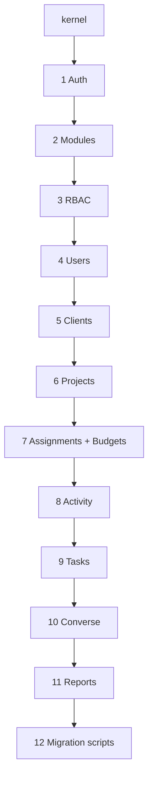

# PTS API v2 — Architecture Blueprint

**Status:** Final architecture report (pre-implementation)  
**Scope:** Greenfield `/api/v2` alongside unchanged legacy `/api/*`  
**Database:** MongoDB, `pts_` collections, ObjectId-only identity  
**Target scale:** 10,000+ projects, multi-year time entry history

---

## Executive Summary

PTS v2 is a **parallel API** — legacy routes and collections remain untouched until cutover. All new code lives under `src/v2/`, mounted at `/api/v2`, using **`pts_*` collections** with **MongoDB ObjectId as the only public identifier**.

Migration from legacy uses a **temporary** `pts_migration_id_maps` collection; it is never exposed in API responses.

Build order is strict: **Auth → Modules → RBAC → Users → Clients → Projects → Assignments/Budgets → Activity → Tasks → Converse → Reports → Migration scripts**.

Cross-cutting concerns (errors, pagination, audit, validation) are centralized in a **shared kernel** so every module follows the same contract.

---

## 1. Folder Structure

Legacy code stays in `src/app/`, `src/routes/`, `src/app/Modules/`. **Do not modify** except one mount point in `server.js`:

```text
project-tracking-system-api/
├── config/
│   ├── mongo.js                    # shared connection (legacy + v2)
│   ├── constants.js
│   └── v2.env.example
├── docs/
│   ├── v2-api-architecture-blueprint.md   # this document
│   └── v2-openapi/                        # generated later
├── scripts/
│   └── v2/
│       ├── migrate/                # one script per module
│       ├── validate/               # reconciliation checks
│       └── seed/                   # bootstrap modules, permissions, admin
├── server.js                       # add: app.use('/api/v2', v2Router)
└── src/
    └── v2/
        ├── index.js                # v2 router aggregator
        ├── kernel/                 # shared foundation (all modules depend on this)
        │   ├── database/
        │   │   ├── connection.js
        │   │   ├── base.schema.js
        │   │   └── pagination.js
        │   ├── http/
        │   │   ├── response.js
        │   │   ├── errors.js
        │   │   ├── async-handler.js
        │   │   └── request-context.js
        │   ├── middleware/
        │   │   ├── authenticate.js
        │   │   ├── authorize.js
        │   │   ├── validate.js
        │   │   ├── rate-limit.js
        │   │   └── request-id.js
        │   ├── audit/
        │   │   ├── audit.service.js
        │   │   └── audit.types.js
        │   ├── logger/
        │   │   └── logger.js
        │   └── utils/
        │       ├── object-id.js
        │       ├── dates.js
        │       └── minutes.js
        └── modules/
            ├── auth/
            │   ├── models/
            │   ├── repositories/
            │   ├── services/
            │   ├── validators/
            │   ├── controllers/
            │   ├── routes/
            │   └── index.js
            ├── modules/            # feature module registry (dashboard, projects, …)
            ├── rbac/
            ├── users/
            ├── clients/
            ├── projects/
            ├── assignments/        # project team + user allocations
            ├── budgets/
            ├── activity/             # time entries, weeks, timers, central validation
            ├── tasks/
            ├── converse/
            ├── reports/
            └── migration/            # internal admin endpoints for migration status (optional)
```

### Per-module internal layout (mandatory convention)

Every module under `src/v2/modules/<name>/`:

| Layer | Responsibility |
|-------|----------------|
| `models/` | Mongoose schema + indexes + model export |
| `repositories/` | DB queries only; no HTTP, no business rules |
| `services/` | Business logic, orchestration, transactions |
| `validators/` | Input schemas (express-validator or zod-style) |
| `controllers/` | HTTP in/out; call services; use kernel response helpers |
| `routes/` | Express router; middleware chain |
| `index.js` | `{ routes, services }` export for cross-module use |

**Rule:** modules may import **kernel** and **downstream contracts** from earlier modules in build order. They must **not** import legacy `src/app/*` code.

---

## 2. Collection Naming Strategy

### Rules

1. Prefix: **`pts_`** for all v2 domain collections.
2. **Plural, snake_case** table names: `pts_users`, `pts_projects`.
3. **No `legacyId`**, no numeric surrogate keys, no auto-increment.
4. Public API IDs = **`_id` as 24-char hex string** only.
5. Foreign keys = **ObjectId refs** with explicit `ref` in schema.
6. Soft delete: `isDeleted: Boolean` + optional `deletedAt`; never hard-delete business data in v1 of v2.
7. Every collection includes `createdAt`, `updatedAt` (timestamps).
8. Schema evolution: `schemaVersion: Number` (default `1`).

### Collection registry

| Collection | Module | Notes |
|------------|--------|-------|
| `pts_accounts` | Auth | Login identity (admin + employee unified or split — see §5) |
| `pts_refresh_tokens` | Auth | Hashed refresh tokens |
| `pts_password_reset_tokens` | Auth | Optional; TTL index |
| `pts_modules` | Modules | Feature flags: dashboard, projects, tasks, … |
| `pts_permissions` | RBAC | `keyName` unique |
| `pts_roles` | RBAC | Links to permission IDs |
| `pts_role_permissions` | RBAC | Junction (normalized) |
| `pts_user_roles` | RBAC | User ↔ role assignments |
| `pts_users` | Users | Employee profiles |
| `pts_clients` | Clients | Client companies/contacts |
| `pts_projects` | Projects | Core project entity |
| `pts_project_assignments` | Assignments | Membership + allocation snapshot |
| `pts_project_user_allocations` | Assignments | Versioned allocation history |
| `pts_project_budgets` | Budgets | Hour/budget buckets |
| `pts_project_requests` | Budgets | Unified approval workflow |
| `pts_project_notes` | Projects | Structured notes |
| `pts_project_files` | Projects | File metadata |
| `pts_project_stats` | Projects | Materialized counters (read model) |
| `pts_project_events` | Kernel/Audit | Domain + audit events |
| `pts_activity_categories` | Activity | Work type taxonomy |
| `pts_time_weeks` | Activity | Weekly submission container |
| `pts_time_entries` | Activity | Individual logs |
| `pts_active_timers` | Activity | Running clocks |
| `pts_tasks` | Tasks | Task V2 clean (replace tasksV2 gradually) |
| `pts_task_*` | Tasks | Workflow, comments, members, etc. |
| `pts_converse_*` | Converse | Rooms, messages, members |
| `pts_report_snapshots` | Reports | Optional pre-aggregated report rows |
| `pts_migration_id_maps` | Migration | **Temporary** legacy → pts mapping |
| `pts_migration_runs` | Migration | Job status, checksums, errors |

### What we deliberately avoid

- Storing legacy numeric IDs on v2 documents (use `pts_migration_id_maps` only).
- Polymorphic `parentType` without indexes — prefer explicit `projectId` fields.
- Duplicate membership collections — **one** assignment source; tasks/converse reference it.

---

## 3. Module-by-Module Build Order

Strict dependency chain. **Do not start a module until its dependencies are merged and seeded.**



| Phase | Module | Delivers | Blocks |
|-------|--------|----------|--------|
| **0** | Kernel | HTTP standards, errors, auth middleware shell, audit | Everything |
| **1** | Auth | Login, refresh, logout, me, JWT | All protected routes |
| **2** | Modules | `pts_modules` CRUD/seed, module enablement | RBAC module scoping |
| **3** | RBAC | Roles, permissions, user-role assignment | All authorization |
| **4** | Users | Employee CRUD, profile, deactivate | Projects, activity |
| **5** | Clients | Client CRUD | Projects |
| **6** | Projects | Project CRUD, types, status, stats job | Assignments, activity, tasks |
| **7a** | Assignments | Team assign, caps, allowExceed, canLogTime | Activity validation |
| **7b** | Budgets | Budget CRUD, requests, retainer automation | Activity validation |
| **8** | Activity | Time entries, weeks, timers, **central validation service** | Reports, tasks time |
| **9** | Tasks | Boards, tasks, workflow (ObjectId project refs) | Reports task metrics |
| **10** | Converse | Chat rooms scoped to projects/users | — |
| **11** | Reports | Dashboards, exports, team views | — |
| **12** | Migration | Backfill scripts, validation, cutover runbook | Production cutover |

### Exit criteria per phase

Each module ships with: models + indexes, routes, validators, service tests, migration script stub, OpenAPI section, seed data (where applicable).

---

## 4. Shared Base Models

All Mongoose schemas extend patterns from `kernel/database/base.schema.js`.

### Base document fields

```javascript
// Conceptual — not implementation
{
  _id: ObjectId,           // only public ID
  schemaVersion: Number,   // default 1
  isDeleted: Boolean,
  deletedAt: Date | null,
  createdAt: Date,
  updatedAt: Date,
}
```

### Base actor fields (where applicable)

```javascript
{
  createdBy: ObjectId,     // ref pts_users or pts_accounts
  updatedBy: ObjectId,
}
```

### Base repository helpers (kernel)

| Helper | Purpose |
|--------|---------|
| `assertObjectId(id, field)` | Reject invalid IDs with `VALIDATION_ERROR` |
| `findByIdOrThrow(Model, id)` | 404 wrapper |
| `softDelete(doc)` | Sets `isDeleted`, `deletedAt` |
| `paginate(query, { cursor, limit, sort })` | Cursor-based pagination |
| `runTransaction(fn)` | Multi-doc atomic updates (assignments + stats) |

### Cross-module service contracts

Define narrow interfaces exported from module `index.js`:

```javascript
// Example contracts (conceptual)
usersService.getActiveUser(userId)
clientsService.getClient(clientId)
projectsService.getLoggableProject(projectId)
assignmentsService.getAssignment(projectId, userId)
budgetsService.resolveBudgetForEntry(projectId, budgetId, entryDate)
activityValidationService.validateTimeEntry(input)  // central
```

Activity module **must not** duplicate assignment/budget logic — it calls `activityValidationService` only.

---

## 5. Auth and RBAC Architecture

### 5.1 Auth model

**Unified account table** (`pts_accounts`) recommended:

| Field | Purpose |
|-------|---------|
| `email` | Unique login |
| `passwordHash` | bcrypt |
| `accountType` | `admin` \| `employee` |
| `userId` | ref `pts_users` when employee |
| `isActive`, `isVerified` | Gate login |
| `mustChangePassword` | Force reset flow |
| `lastLoginAt` | Audit |

Alternative (if admin separation required): `pts_admin_accounts` + `pts_accounts` — still ObjectId-only.

**Tokens:**

| Token | Storage | TTL |
|-------|---------|-----|
| Access JWT | Client memory | 15–60 min |
| Refresh | `pts_refresh_tokens` (SHA-256 hash) | 30 days, rotatable |

**JWT payload (minimal):**

```json
{
  "sub": "<accountObjectId>",
  "type": "access",
  "accountType": "employee",
  "userId": "<pts_users ObjectId if employee>"
}
```

Permissions are **not** embedded in JWT — loaded on `/auth/me` and cached client-side; server always re-checks via RBAC middleware.

### 5.2 RBAC model (normalized)

```text
pts_modules          (dashboard, projects, tasks, time, clients, reports, settings, converse)
pts_permissions      (projects.view, time.create, …)
pts_roles            (Employee, Manager, Admin, Super Admin)
pts_role_permissions (roleId, permissionId)
pts_user_roles       (userId, roleId, assignedAt)
```

**Authorization middleware chain:**

```
authenticate → loadAccount → authorize(['projects.update']) → optional moduleEnabled('projects')
```

**Permission naming:** `<domain>.<action>` with optional scope suffix (`time.view_own`, `time.view_team`, `time.view_all`).

**Super Admin:** role flag or wildcard permission `*.*` — avoid hard-coded bypasses scattered in controllers.

### 5.3 Module enablement (feature flags)

`pts_modules` documents:

```javascript
{
  keyName: 'projects',      // unique
  name: 'Projects',
  isActive: true,           // org-wide toggle
  sortOrder: Number,
}
```

Middleware `moduleEnabled('projects')` checks module active **and** user has any permission in that module namespace.

### 5.4 Auth API surface (`/api/v2/auth`)

| Method | Path | Auth |
|--------|------|------|
| POST | `/login` | Public |
| POST | `/refresh` | Public (refresh token body) |
| POST | `/logout` | Bearer |
| GET | `/me` | Bearer |
| POST | `/change-password` | Bearer |
| POST | `/forgot-password` | Public |
| POST | `/reset-password` | Public (token) |

---

## 6. Database Schema Strategy

### 6.1 Identity

- **Single source of truth:** `_id` ObjectId.
- API path params: `/projects/:projectId` where `projectId` is ObjectId string.
- Validation: 24-char hex; reject numeric IDs with `400 INVALID_ID`.

### 6.2 References

- Always store `ObjectId` FK + optional denormalized snapshot **only** for read-heavy list views (e.g. `clientName` on project list from `pts_project_stats`).
- Snapshots updated by event handlers — not on every read.

### 6.3 Project types (enum)

`fixed_hours` | `fixed_budget` | `retainer` | `hybrid` | `internal`

Type-specific config on `pts_projects` (sparse fields):

| Type | Required config |
|------|-----------------|
| fixed_hours | `fixedHours` |
| fixed_budget | `budgetAmount`, optional `estimatedHours` |
| retainer | `retainerHoursPerMonth`, `retainerRenewalDay` |
| hybrid | retainer + phase hours |
| internal | optional `estimatedHours`, non-billable defaults |

### 6.4 Assignments + allocations

**`pts_project_assignments`** (current state):

```javascript
{
  projectId, userId,
  status: 'assigned' | 'unassigned',
  role: String,
  canLogTime: Boolean,
  allocation: {
    allocatedMinutes: Number | null,
    capPeriod: 'none' | 'day' | 'week' | 'month' | 'project',
    allowExceed: Boolean,
    effectiveFrom: Date,
  },
  stats: {
    consumedMinutes: Number,    // maintained by activity service
    lastEntryAt: Date,
  },
}
```

**`pts_project_user_allocations`** — append-only when admin changes caps.

### 6.5 Budgets

**`pts_project_budgets`** with `allocatedMinutes`, `consumedMinutes`, `allowExceed`, `periodStart/End`, `budgetType`, `status`.

**`pts_project_requests`** — unified: additional hours, phase extension, scope change, deadline change.

### 6.6 Read models

**`pts_project_stats`** — one doc per project, updated incrementally:

- Budget totals, time totals, assignment count, task counts, `lastActivityAt`.
- Admin list endpoints read **stats only** — no aggregation on `pts_time_entries` at list time.

### 6.7 Index strategy (mandatory at schema creation)

Every model file exports `ensureIndexes()` called on app bootstrap (like announcements module today).

Critical compound indexes:

- `pts_projects`: `{ clientId: 1, normalizedTitle: 1, isDeleted: 1 }` unique
- `pts_project_assignments`: `{ projectId: 1, userId: 1, isDeleted: 1 }`
- `pts_time_entries`: `{ userId: 1, projectId: 1, entryDate: 1, status: 1 }`
- `pts_time_entries`: `{ budgetId: 1, status: 1 }`
- `pts_project_stats`: `{ lastActivityAt: -1 }`

### 6.8 Transactions

Use MongoDB transactions for:

- Assign user + update `pts_project_stats.assignmentCount`
- Approve budget request → create budget + update request + emit event
- Time entry create → increment assignment stats + budget consumed + project stats

---

## 7. API Response Standards

### 7.1 Envelope

**Success (single resource):**

```json
{
  "success": true,
  "data": { "id": "665f1a2b3c4d5e6f7a8b9c0d", "...": "..." },
  "meta": {
    "requestId": "uuid",
    "timestamp": "2026-05-21T12:00:00.000Z"
  }
}
```

**Success (list):**

```json
{
  "success": true,
  "data": [ "..." ],
  "pagination": {
    "limit": 50,
    "hasMore": true,
    "nextCursor": "base64opaque",
    "total": null
  },
  "meta": { "requestId": "...", "timestamp": "..." }
}
```

**Note:** `total` is optional — expensive on large collections; use only when filtered set is bounded.

### 7.2 Field naming

- **snake_case** in JSON (matches current Angular services).
- IDs: always `"id"` string (ObjectId hex), never `legacyId`, never numeric.
- Minutes internally; API exposes both `duration_minutes` and formatted labels where helpful.
- Dates: ISO 8601 UTC strings.

### 7.3 Standard headers

| Header | Purpose |
|--------|---------|
| `Authorization: Bearer <access>` | Auth |
| `X-Request-Id` | Correlation (echo in response meta) |
| `X-API-Version: 2` | Optional explicit version |

### 7.4 Idempotency (recommended for writes)

`Idempotency-Key` header on POST for time entries and budget approvals — store key in `pts_idempotency_keys` TTL 24h.

---

## 8. Error Handling Standards

### 8.1 Error envelope

```json
{
  "success": false,
  "error": {
    "code": "CAP_EXCEEDED",
    "message": "Your allocated hours for this project are exhausted.",
    "details": {
      "allocatedMinutes": 480,
      "consumedMinutes": 480,
      "remainingMinutes": 0,
      "requestedMinutes": 60
    },
    "fields": {
      "durationMinutes": "Exceeds remaining allocation"
    }
  },
  "meta": {
    "requestId": "uuid",
    "timestamp": "..."
  }
}
```

### 8.2 HTTP status mapping

| Status | When |
|--------|------|
| 400 | Validation, invalid ObjectId |
| 401 | Missing/invalid token |
| 403 | Authenticated but not permitted / module disabled |
| 404 | Resource not found (or soft-deleted without admin scope) |
| 409 | Conflict — duplicate title, cap exceeded, budget exceeded, overlap |
| 422 | Semantic rule failure |
| 429 | Rate limit |
| 500 | Unexpected — logged with requestId |

### 8.3 Error codes (registry in kernel)

Domain codes (non-exhaustive):

| Code | Module |
|------|--------|
| `INVALID_ID` | Kernel |
| `VALIDATION_ERROR` | Kernel |
| `UNAUTHORIZED`, `FORBIDDEN` | Auth/RBAC |
| `MODULE_DISABLED` | Modules |
| `PROJECT_NOT_LOGGABLE` | Projects |
| `ASSIGNMENT_NOT_FOUND` | Assignments |
| `TIME_LOGGING_DISABLED` | Assignments |
| `CAP_EXCEEDED` | Activity |
| `BUDGET_EXCEEDED` | Activity |
| `BUDGET_SELECTION_REQUIRED` | Budgets |
| `WEEK_LOCKED` | Activity |
| `TIMER_ALREADY_RUNNING` | Activity |
| `ENTRY_OVERLAP` | Activity |

**Rule:** every `409` from activity validation **must** include machine-readable `error.code` + `details` for UI.

### 8.4 Implementation pattern

- Custom `AppError extends Error` with `{ status, code, details, fields }`.
- `asyncHandler(fn)` wraps controllers.
- Global error middleware maps unknown errors → 500, logs stack with requestId.
- **Never** expose stack traces in production.

---

## 9. Audit Logging Strategy

### 9.1 Two layers

| Layer | Storage | Purpose |
|-------|---------|---------|
| **Technical logs** | Winston → stdout/files/Datadog | Debugging, performance |
| **Domain audit** | `pts_project_events` + module-specific event collections | Business audit trail |

### 9.2 `pts_project_events` (and global `pts_audit_events` optional)

```javascript
{
  eventType: 'assignment.allocation_changed',
  entityType: 'pts_project_assignments',
  entityId: ObjectId,
  projectId: ObjectId,          // nullable for global events
  actorId: ObjectId,
  payload: {
    before: { allocatedMinutes: 480 },
    after: { allocatedMinutes: 600 },
    reason: 'Scope increase',
  },
  requestId: String,
  createdAt: Date,
}
```

### 9.3 What to audit

| Event | Module |
|-------|--------|
| login, logout, failed login | Auth |
| role/permission changes | RBAC |
| user activate/deactivate | Users |
| project create/update/status | Projects |
| assignment, allocation change | Assignments |
| budget create/approve/reject | Budgets |
| time entry create/update/delete | Activity |
| validation failure (optional debug flag) | Activity |
| task status changes | Tasks |

### 9.4 Retention

- Domain events: **7 years** (configurable) — business requirement for time/billing.
- Technical logs: 30–90 days.
- TTL index on debug-level validation events: 30 days.

---

## 10. Migration Strategy (Old API → v2)

### 10.1 Principles

1. **Legacy API frozen** — bugfixes only; no new features on `/api/*`.
2. **No legacy IDs in v2 docs** — mapping table only.
3. **Module-by-module backfill** matching build order.
4. **Validate before switch** — automated reconciliation per module.
5. **Frontend strangler** — Angular calls `/api/v2` module by module behind feature flags.

### 10.2 `pts_migration_id_maps`

```javascript
{
  legacyCollection: 'projects',
  legacyId: Number | String,     // temporary — NOT exposed
  ptsCollection: 'pts_projects',
  ptsId: ObjectId,
  migratedAt: Date,
  checksum: String,              // hash of source doc
  migrationRunId: ObjectId,
}
```

Unique index: `{ legacyCollection: 1, legacyId: 1 }`.

**Drop policy:** keep until full cutover + 90 days stable; then archive and remove.

### 10.3 Migration run tracking (`pts_migration_runs`)

```javascript
{
  module: 'projects',
  status: 'running' | 'completed' | 'failed',
  startedAt, completedAt,
  processed: Number,
  failed: Number,
  errors: [{ legacyId, message }],
}
```

### 10.4 Module migration order

| Step | Script | Validates |
|------|--------|-----------|
| 1 | `migrate-modules.js` | Module keys match |
| 2 | `migrate-rbac.js` | Permission count |
| 3 | `migrate-users.js` | User count, email unique |
| 4 | `migrate-clients.js` | Client count |
| 5 | `migrate-projects.js` | Project count, client FK |
| 6 | `migrate-assignments.js` | Assignment count per project |
| 7 | `migrate-budgets.js` | Budget minutes sum |
| 8 | `migrate-time-entries.js` | Sum minutes per project/user |
| 9 | `migrate-tasks.js` | Task count per project |
| 10 | `migrate-converse.js` | Room/message counts |
| 11 | `rebuild-stats.js` | Stats match raw aggregates |

### 10.5 Cutover phases

| Phase | Action |
|-------|--------|
| **A — Dual existence** | v2 populated; legacy still primary for UI |
| **B — Dual write** | Optional short window if needed (prefer read switch only) |
| **C — Read switch** | Angular feature flags → `/api/v2` per module |
| **D — Legacy read-only** | Disable legacy mutations |
| **E — Decommission** | Archive legacy collections |

### 10.6 Rollback

- v2 collections independent — rollback = flip feature flags back to `/api/*`.
- Keep legacy collections untouched until Phase E.

---

## 11. Testing Strategy

### 11.1 Pyramid

| Level | Tool | Focus |
|-------|------|-------|
| Unit | Node test runner (add Jest or Node native test) | Services, validators, validation algorithm |
| Integration | Supertest + MongoDB Memory Server or test DB | Routes + real DB |
| Contract | OpenAPI schema validation | Response shape |
| E2E | Postman/Newman or Playwright against API | Critical flows |

### 11.2 Mandatory test suites per module

- **Auth:** login, refresh rotation, revoked token, inactive user.
- **RBAC:** permission denied, module disabled, scope escalation blocked.
- **Projects:** create each project type, duplicate title per client fails.
- **Assignments:** cap saved, allowExceed honored, canLogTime false blocks.
- **Activity:** central validation — cap period windows, budget exceed chain, timer stop.
- **Migration:** fixture subset → migrate → reconcile totals.

### 11.3 CI pipeline (recommended)

```text
lint → unit tests → integration tests (docker mongo) → migration dry-run on fixture → build
```

### 11.4 Test data

- `scripts/v2/seed/` creates deterministic org: 1 admin, 2 managers, 5 employees, 3 clients, 20 projects.
- Never seed production.

---

## 12. Deployment Strategy

### 12.1 Runtime

- Same Node process serves **both** `/api/*` and `/api/v2` (current PM2 setup).
- Environment variables:

```bash
PTS_V2_ENABLED=true
MONGODB_URI=...
JWT_ACCESS_SECRET=...
JWT_REFRESH_SECRET=...
```

### 12.2 Bootstrap sequence (on deploy)

1. Connect MongoDB.
2. `kernel.ensureIndexes()` for shared collections.
3. Per-module `ensureIndexes()` (parallel, idempotent).
4. `seedModules()` + `seedPermissions()` if empty (idempotent).
5. Start HTTP server + Socket.io (tasks/converse when ready).

### 12.3 Rolling deploy

- Backward compatible v2 changes only within same major version.
- Index creation before traffic switch (`background: true`).
- Migration scripts run as **separate job** (not in request path).

### 12.4 Observability

| Signal | Implementation |
|--------|----------------|
| Health | `GET /healthz` (existing) + `GET /api/v2/health` (v2 DB ping) |
| Metrics | Request duration, error rate by `error.code` |
| Logs | JSON structured logs with `requestId`, `userId`, `module` |
| Alerts | Migration failures, validation error spike, 5xx rate |

### 12.5 Socket.io

- Namespace `/v2` for tasks and converse (do not mix with legacy task-system events).
- Auth: JWT in handshake query/header; same `authenticate` logic.

---

## 13. Risks and Mitigations

| Risk | Impact | Mitigation |
|------|--------|------------|
| **Scope creep** — rebuilding everything at once | Never ship | Strict module order; MVP per module; feature flags |
| **Dual API confusion** | Frontend bugs | Clear `/api/v2` client service layer in Angular; no mixing in one service method |
| **Migration data drift** | Wrong totals | Reconciliation scripts; `pts_project_stats` rebuild job; block cutover on mismatch |
| **Performance regression** | Slow lists at 10k projects | Stats read model; cursor pagination; no populate chains on list |
| **Authorization gaps** | Security incident | Every v2 route uses `authenticate` + `authorize`; automated 403 tests |
| **Time validation duplication** | Inconsistent rules | **Single** `activityValidationService`; forbid budget/cap checks elsewhere |
| **ObjectId in URLs** | Invalid IDs | Central `assertObjectId` middleware on all `:id` params |
| **Legacy coupling temptation** | Contaminated v2 | ESLint rule: no imports from `src/app/` or `src/routes/` into `src/v2/` |
| **Task V2 still uses legacy project refs** | Blocks clean v2 | New `pts_tasks` reference `pts_projects._id` only; migrate tasks after projects |
| **Refresh token races** | Double refresh | Rotate refresh token atomically; revoke old on use |
| **Index build on large DB** | Deploy timeout | Run index builds as pre-deploy job; use `background: true` |
| **No automated tests today** | Regressions | Add test runner in Phase 0 kernel before Auth implementation |

---

## Appendix A — v2 Route Map (Target)

```text
/api/v2/auth/*
/api/v2/modules/*
/api/v2/rbac/roles/*
/api/v2/rbac/permissions/*
/api/v2/users/*
/api/v2/clients/*
/api/v2/projects/*
/api/v2/projects/:projectId/assignments/*
/api/v2/projects/:projectId/budgets/*
/api/v2/projects/:projectId/requests/*
/api/v2/projects/:projectId/notes/*
/api/v2/projects/:projectId/files/*
/api/v2/projects/:projectId/logging-context    # employee pre-flight
/api/v2/activity/categories/*
/api/v2/activity/weeks/*
/api/v2/activity/entries/*
/api/v2/activity/timers/*
/api/v2/activity/entries/validate              # dry-run
/api/v2/tasks/*
/api/v2/converse/*
/api/v2/reports/*
/api/v2/health
```

---

## Appendix B — Central Time Validation Service (Contract)

**Module:** `activity`  
**Service:** `TimeValidationService.validate(input)`

### Input

```javascript
{
  userId: ObjectId,
  projectId: ObjectId,
  budgetId: ObjectId | null,
  entryDate: Date,
  durationMinutes: Number,
  excludeEntryId: ObjectId | null,
}
```

### Algorithm (ordered)

1. Load project → must be loggable (`active`, not deleted).
2. Load assignment → assigned, `canLogTime: true`.
3. Resolve budget for `entryDate` (or require explicit if multiple).
4. **User cap** — sum entries in `capPeriod` window; enforce unless `allocation.allowExceed`.
5. **Budget cap** — enforce unless `budget.allowExceed` OR `project.allowBudgetExceed`.
6. Return `{ allowed: true, budgetId, remaining: { user, budget } }` or throw `AppError`.

All entry create/update/timer-stop paths call this service **before** persist.

---

## Appendix C — Relationship to Existing Code

| Existing | v2 approach |
|----------|-------------|
| `/api/auth`, `legacyId` users | Replace with `/api/v2/auth`, `pts_accounts` + `pts_users` |
| `/api/modules-management` | Replace with `/api/v2/modules` |
| Hard-coded `ROLE_PERMISSIONS` in access-control.service | DB-driven `pts_roles` + `pts_permissions` |
| `/api/project/*` unauthenticated | v2 always authenticated + authorized |
| `tasksV2` with `projectRef.sourceId` numeric | `pts_tasks.projectId` ObjectId ref |
| `working_hours` legacy | Not migrated — activity uses `pts_time_entries` only |
| Task-v2 module structure | **Template** for folder layout, not for ID strategy |

---

## Appendix D — Implementation Checklist (Phase 0 — Kernel)

Before Auth module starts:

- [ ] Create `src/v2/` tree and mount `/api/v2` in `server.js`
- [ ] Implement kernel: errors, response, asyncHandler, requestId, assertObjectId
- [ ] Implement logger (Winston JSON)
- [ ] Implement audit.service stub
- [ ] Add ESLint/no-restricted-imports: v2 cannot import legacy
- [ ] Add test runner + first kernel unit tests
- [ ] Document OpenAPI stub at `docs/v2-openapi/openapi.yaml`

---

*End of blueprint. No implementation code included by design.*
